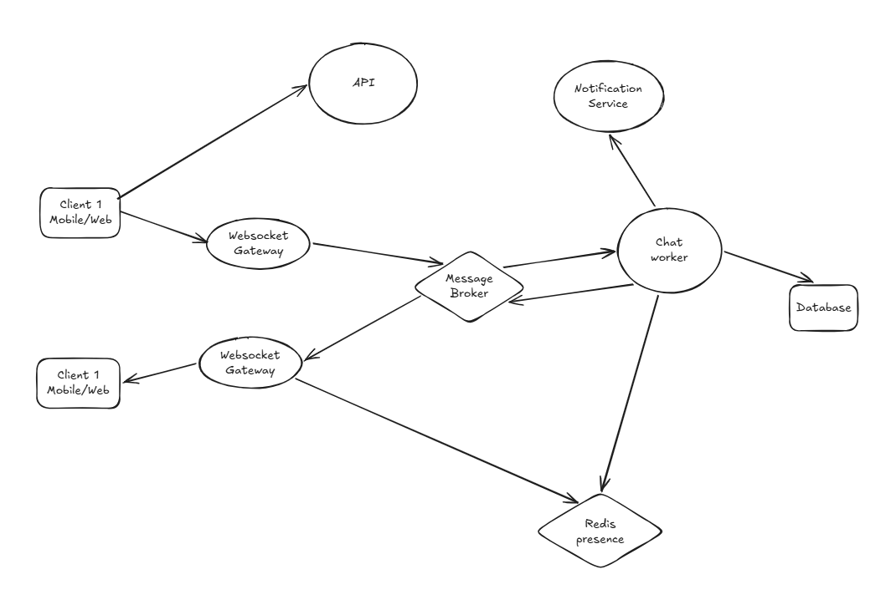

# Part 2: High-Level Architecture & End-to-End Message Flow

1. API Service:
    - Xử lý Authentication
    - Fetch History Message, Conversation
2. Websocket Gateway:
    - Giữ kết nối socket của các client, có thể có nhiều node để scale phục vụ cho nhiều client
    - Mỗi ws gateway node đăng ký một queue/channel riêng. Channel này dùng để làm địa chỉ gateway cho việc delivery tin nhắn đến người nhận.
    - Mission:
        - Thiết lập kết nối từ client và set presence lên Redis presence Service
        - Nhận message từ client và gửi lên Broker
        - Consume message từ broker và gửi xuống cho client
3. Message Broker:
    - Tác dụng là decoupling giữa websocket gateway và chat worker.
    - Many to many fanout
    - Buffer Message, backpressure giúp điều tiết message dựa trên khả năng làm việc của các Gateway WS.
    - Message buffer để điều tiết khả năng làm việc của chat worker.
    - Channel:
        - Direct Message: message được publish lên channel GateWay. Ví dụ Gateway 1 thì sẽ có channel gateway_1.
        - Clan Message: channel Clan (clan:abc, clan:xyz)
        - Region Message: channel Region (vn, cn, us)
        - Global Message: channel global (global)
    - Việc phân chia channel như trên giúp giảm số lượng tin nhắn gửi đến clan, region, global có lượng người dùng lớn. Chúng ta chỉ cần gửi một tin nhắn đến channel là được.
4. Chat Worker:
    - Validate quyền gửi tin, Idempotency check (chống trùng), ghi DB.
    - Query presence từ Redis, nếu như không online thì thực hiện gửi vào noti service. Nếu online thì bắn qua Broker.
5. Redis Presence Service:
    - Lưu trữ presence cho các user và các device tương ứng.
    - Công thức: {user_id}:{device_id}:{gateway_node}
6. Notification Service: 
    - Xử lý đẩy Apple APNs / Google FCM khi Receiver đang offline hoặc App ở background.
7. Database:
    - **Partition Key:** conversation_id (đảm bảo toàn bộ tin nhắn trong 1 room nằm cùng 1 Partition node).
    - **Clustering Key:** message_id (Time-based UUIDv7) giúp sort tin nhắn theo thời gian tự nhiên.

## 3. Detailed End-to-End Flows

### Flow 1: Gửi tin nhắn Direct (1-1) & Luồng ACK 2 Chiều (Online Case)

Kịch bản: **Client A** gửi tin nhắn cho **Client B** (Client B đang Online tại WS Gateway 2).

- **Bước 1 - 3 (Inbound):** Client A gửi tin nhắn qua WebSocket. WS Gateway 1 đẩy ngay vào Broker Inbound Topic.
- **Bước 4 - 5 (Sender ACK):** Chat Worker consume tin nhắn, lưu vào ScyllaDB với trạng thái SENT. Đồng thời trả ngay **Sender ACK** về cho Client A (Client A hiển thị dấu tích xám ).
- **Bước 6 - 9 (Outbound Delivery):** Worker tra cứu Redis thấy Client B đang online ở WS Gateway 2. Worker publish event vào Queue gateway-node-02. WS Gateway 2 lấy tin nhắn và push qua WebSocket xuống Client B.
- **Bước 10 - 13 (Receiver ACK & Delivery Status):** Client B nhận tin thành công, App tự động trả về ACK_DELIVERED. Chat Worker nhận ACK này, update DB thành DELIVERED và bắn notify cho Client A (Client A đổi thành 2 dấu tích ).

### Flow 2: Offline Messaging & Sync khi Reconnect

Kịch bản: **Client B** bị đứt mạng/offline khi Client A gửi tin.

1. **Khi Client B Offline:**
    - Tại **Bước 6 (Flow 1)**, Chat Worker query Redis Presence  Trả về OFFLINE.
    - Worker không bắn vào Gateway Queue mà push event sang Notification Queue.
    - Notification Service gửi Push Notification (APNs/FCM) tới thiết bị Client B: *"Bạn có tin nhắn mới từ A"*.
2. **Khi Client B Reconnect (Sync State):**
    - Client B mở lại App, thiết lập kết nối WebSocket mới tới WS Gateway 3.
    - Client B **KHÔNG** đợi server push lại tin nhắn qua WebSocket, mà sẽ chủ động gọi một **HTTP REST API** sang API Gateway:
        
        GET /v1/conversations/{id}/messages?after_id={last_received_msg_id}
        
    - API Gateway đọc từ ScyllaDB và trả về danh sách tin nhắn Client B đã bỏ lỡ (Missed Messages).
    - **Ưu điểm:** Giúp giảm tải tuyệt đối cho Hệ thống WebSocket Real-time, tránh tình trạng "Stampeding Herd" (hàng ngàn client reconnect cùng lúc làm ngập luồng Socket).

## 4. Architectural Trade-offs & Deep Dives (Tư duy Thiết kế)

### 1. Tại sao dùng Hybrid Fan-out (Direct vs Group Chat)?

- **1-1 & Small Group (< 100 members):** Dùng **Fan-out on Write**. Worker nhân bản tin nhắn và gửi tới Queue của từng member.
- **Large Group / Channel (> 10,000 members):** Dùng **Fan-out on Read / Gateway Local Broadcast**. Worker chỉ gửi **1 tin nhắn duy nhất** tới từng WS Gateway Node có chứa member của Group đó. Sau đó, bản thân Gateway Node đó sẽ tự Broadcast tới các Socket Connections cục bộ. Cấu trúc này tránh làm "nổ" Message Broker.

### 2. Đảm bảo Idempotency (Chống trùng tin nhắn)

Do mạng chập chờn, Client A có thể gửi lại 1 tin nhắn nhiều lần (Retry).

- Client luôn tạo một client_msg_id (UUIDv7) tại Local.
- Server dùng client_msg_id làm Unique Key/Deduplication Key tại Redis trong  giây. Nếu gặp ID đã xử lý, Server bỏ qua việc ghi DB và trả về ngay Success ACK cũ.